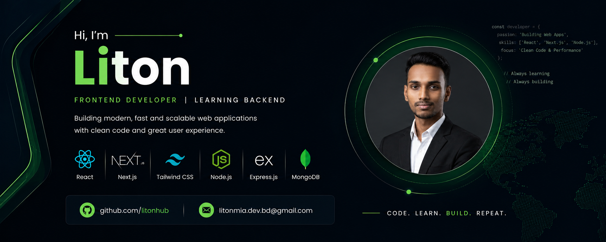

  

# Hi 👋 I'm Liton

💻 Frontend Developer | Learning Backend Development
🚀 Building modern full-stack web applications with React & Node.js

## 👨‍💻 About Me

- 🌱 Learning Backend Development
- ⚛️ Frontend: React, Next js, Tailwind CSS
- 🔥 Backend: Node.js, Express.js, MongoDB
- 📦 REST API Development
- 🎯 Currently building production-level Full Stack Projects
- 📫 Email: litonmia.dev.bd@gmail.com

---

## 🚀 Tech Stack

### Frontend
- HTML5
- CSS3
- JavaScript (ES6+)
- React
- Tailwind CSS
- Redux Toolkit
- React Router
- Next js

### Backend
- Node.js
- Express.js
- MongoDB
- Mongoose
- JWT
- Multer
- Cloudinary

### Tools

Git • GitHub • VS Code • Postman • Render • Vercel • Firebase • MongoDB Compass • Figma

---

## Featured Projects

### 🛒 Ecobazar Ecommerce

Production-ready Full Stack Ecommerce

Frontend
- React
- Redux Toolkit
- Tailwind CSS

Backend
- Express
- MongoDB
- JWT Authentication
- Product API
- File Upload

---

### 📺 IPTV Sports App

React + HLS Streaming Application

Features

- Responsive UI
- Live Streaming
- Fullscreen
- Mobile Optimized

---

## GitHub Stats

(Stats Badges)

---

## Connect with Me

Email: litonmia.dev.bd@gmail.com
